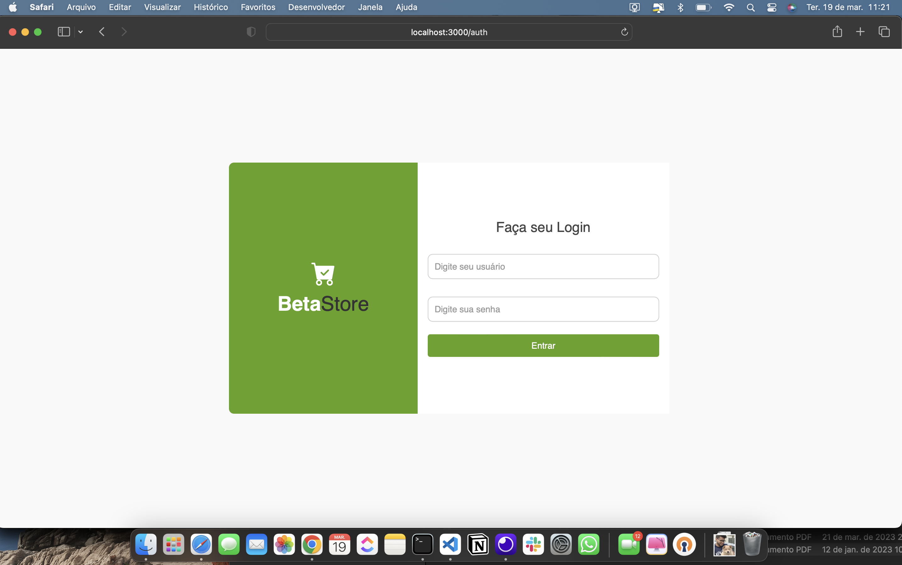
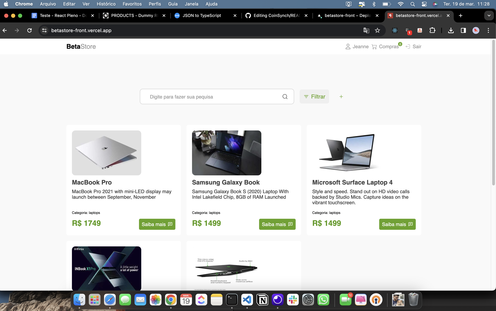
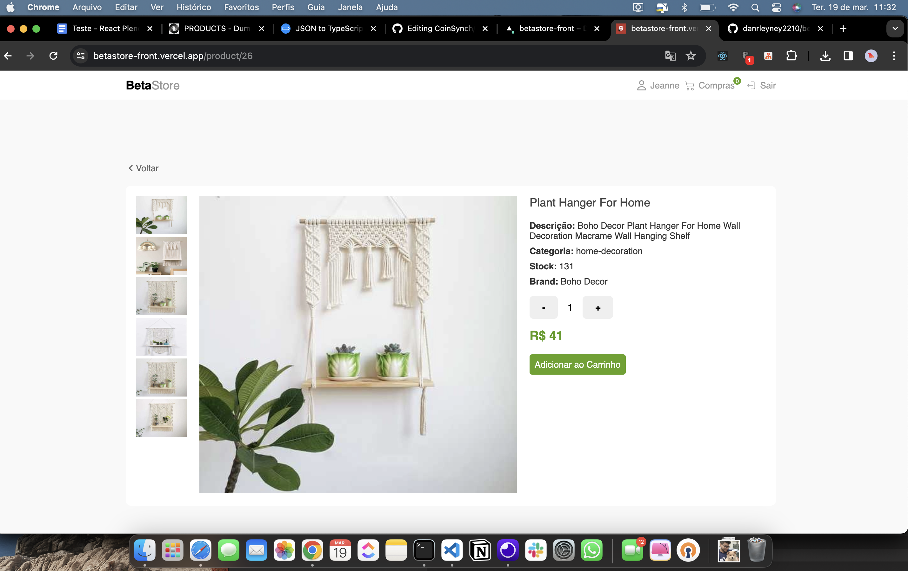
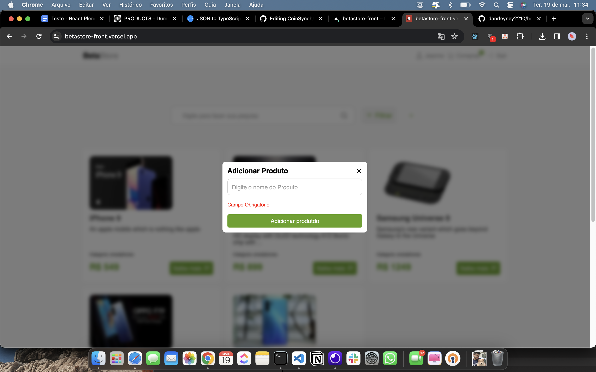
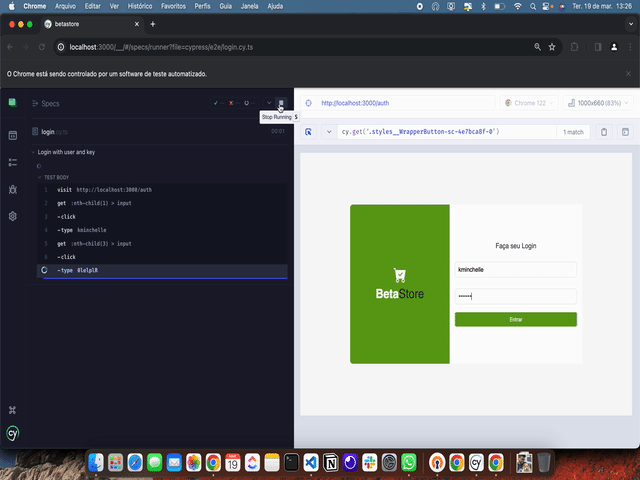

## 💻 Sobre o desafio

- O desafio consiste em desenvolver uma simples aplicação WEB para um curso on-line, com as seguintes funcionalidades:

* C.R.U.D de Produtos
* Listagem (Com paginação);
* Criação;
* Alteração;
* Deletar;

- Cada produto pode ter uma ou mais categorias vinculadas ao produto.
- Busca de Produtos(No Front)
- Buscar produtos por Title ou Brand Ordenacao de produtos por Title ou Brand

- Deve se mostrar todos os atributos que tiverem na API

- API DE REFERENCIA
- Utilize a API de refência como https://dummyjson.com/docs/products;

## Deploy feito na Vercel
- link: <a> https://betastore-front.vercel.app/</a>

### Login 
* Para Logar no sistema use as credênciais abaixo: 
*  user: kminchelle
* key: 0lelplR

## 🔖 Layout

- O Layout foi desenvolvido por mim, sem nenhum figma ou ponto de referência

## Login Auth

<h1 align="center">
  
</h1>

## Home Page

<h1 align="center">
  
</h1>

## Datalhes do produto

<h1 align="center">
  
</h1>

## Adicionar Produto

<h1 align="center">
  
</h1>

### Teste automatizado de Login com Cypresscom usando credenciais

> Teste realizado para efetuar Login.

### Tecnologias Usadas

- Next 14
- Typescript
- React-Hook-Forms
- React Icons - Biblioteca de icones.
- Styled Components - CSS-in-js
- Prettier - Formatador de código opinativo.
- Cypress - Para testes automatizado e testes em library.
- Eslint - Ferramenta para identificar e relatar os padrões encontrados no código ECMAScript /
  JavaScript, com o objetivo de tornar o código mais consistente e evitar bugs.
- Axios - Cliente HTTP baseado em promessa para node. jse o navegador.
- react-lottie - Para animações utilizando o formato JSON
- react-toastify - Para Feedback e alertas personalizados.
Veja o arquivo <a>package.json</a>

### 🦸 Desenvolvedor 🤘

Feito com ❤️ por Danrley Ney 👋🏽 Entre em contato! <a>www.danrley.dev</a>

